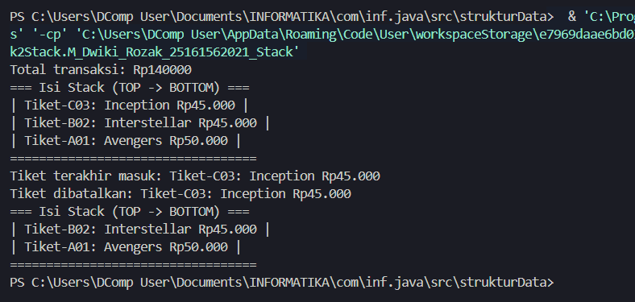

# Simulasi Sistem Transaksi Tiket Bioskop (Stack)

Tugas individu untuk mata kuliah **Struktur Data**. Program ini mengimplementasikan struktur data **Stack (Tumpukan)** secara manual menggunakan array dalam bahasa pemrograman Java.

## 👤 Identitas

- **Nama:** [Mohamad Dwiki Rozak]
- **NIM:** [25161562021]
- **Kelas:** [ INF 2A]

## 📋 Latar Belakang Kasus

Sebuah bioskop menggunakan sistem digital untuk mencatat riwayat transaksi pembelian tiket. Setiap transaksi yang masuk disimpan secara bertumpuk transaksi terbaru selalu berada di posisi paling atas dan dapat dibatalkan (di-pop) terlebih dahulu. Sistem ini secara alami mengikuti prinsip LIFO (Last In, First Out) yang merupakan karakteristik utama struktur data Stack. Mahasiswa diminta untuk membangun program Java sederhana yang mensimulasikan sistem pencatatan transaksi tiket bioskop menggunakan Stack yang diimplementasikan secara manual menggunakan array.

## 🛠️ Fitur & Operasi Stack

Program ini mencakup operasi dasar Stack sebagai berikut:

- **Push**: Menambahkan data tiket ke tumpukan (dengan validasi _overflow_).
- **Pop**: Menghapus dan mengambil data tiket teratas (dengan validasi _underflow_).
- **Peek**: Melihat data tiket teratas tanpa menghapusnya.
- **isEmpty**: Mengecek apakah tumpukan dalam keadaan kosong.
- **Tampilkan Stack**: Menampilkan seluruh urutan tiket dari posisi teratas ke terbawah.
- **Hitung Total (Bonus)**: Menghitung total nominal rupiah dari seluruh tiket yang ada di dalam stack.

## 💻 Tampilan Output

